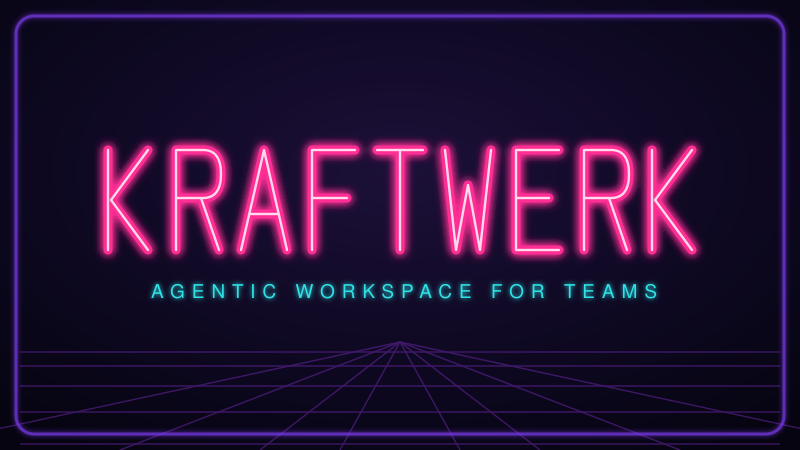

<p align="center">
  
</p>

# Kraftwerk

**Agentic workspace.** Kraftwerk is an open-source agentic workspace where
humans and persistent AI coworkers work on real tasks together. Agents,
knowledge, skills and workflows belong to the team, not to the person who
happened to set them up, and every result is checked before anyone relies on
it.

## Why teams need it

AI work today lives in individual silos: personal prompts, Claude Code
sessions, scripts, and one-off automations. What one person figures out stays
with that person. Kraftwerk gives a team or organisation one place where AI
use becomes shared, repeatable practice.

- **From silos to shared practice.** Prompts, sessions and scripts turn into
  workflows, skills and knowledge that everyone can see, use and improve.
- **Coworkers, not chats.** Agents have a name, a role, a memory and standing
  orders. They keep the knowledge they work with current, and every
  conversation continues where the last one ended.
- **Work you can trust.** Each agent step has to pass deterministic checks
  before the work moves on. Every run leaves a trace with what happened, how
  long it took and what it cost.

## What's in the workspace

**Agents.** Persistent AI coworkers, each with its own identity and memory,
running on Claude Code, Codex, Pi, and others. An agent has a name, an emoji,
a role, a harness + model to run on, and the workflows and knowledge that
belong to its job. Sessions are conversations with that same agent. Routines
are cron-scheduled prompts, like standing orders: each due routine opens a
session, runs unattended, and lands in the sidebar for review.

```yaml
# agents/max/agent.yml
name: Max
emoji: 🛠️
description: Runs and explains this project's workflows
harness: claude        # claude | codex | pi
model: sonnet
workflows: [tagline, website-check]
knowledge: [customer-support]   # bundles it consults & maintains
```

**Knowledge.** Shared organisational and project context, kept as
[OKF](https://github.com/GoogleCloudPlatform/knowledge-catalog/blob/main/okf/SPEC.md)
bundles: plain markdown pages with provenance in the frontmatter (who wrote it,
from what, who confirmed it, until when it is current). Agents read and write
it in chats and mid-workflow; humans browse it like a wiki, edit pages in a
document editor with autosave, verify them with one click, and export bundles
or single pages as PDF.

**Skills.** Reusable capabilities and ways of working: instruction packages a
team maintains once and every agent can use. Type `/` in any chat to invoke
one, on claude, codex and pi alike.

**Workflows.** Repeatable multi-step processes: a sequence of agent and script
steps described in YAML, with prompts as markdown files next to it. Run them
from the UI, the CLI, a routine, or CI.

**Verification.** Deterministic gates that check the work. A gate reads the
files on disk ("brand.md is non-empty", "report.html contains `</html>`") and
never trusts what the agent claims. Fail a gate and the agent fixes it in the
same conversation.

**Inspector.** The web UI for all of the above: agents and their sessions,
knowledge, skills, workflows, and live runs with phase timeline, trace and
artifacts. A prebuilt app served by a dependency-free Node server, so it
starts instantly.

```bash
npx @netnodeag/kraftwerk ui        # http://localhost:1981
```

## How it works under the hood

Code owns the control flow; agents work inside bounded steps. "Agent
proposes, code disposes."

A workflow is a list of steps of two kinds. An **agent step** spawns one
short-lived CLI process (`claude -p`, `codex exec`, or `pi`), hands it one
task, and reads back a typed JSON envelope with phase, status, artifacts and
summary. Then the step's gates run against the files. Pass every gate and the
run moves on; fail one and its message goes back to the same agent session
for another try, up to a retry limit. A **script step** is deterministic
code, a bash script or a TS function, for fetching, rendering, templating,
anything that needs no judgment. Same envelope, same gates, no model.

There is no SDK to bind to, so you can mix models from different vendors in
one workflow and change the model behind a step by editing one line. Steps on
the same harness share one resumed session; steps on different harnesses
share state only through the run's files. Every run writes a `trace.jsonl`
event log and ends with a table of time, tokens, and cost per step.

## Get started

Kraftwerk is on npm as
[`@netnodeag/kraftwerk`](https://www.npmjs.com/package/@netnodeag/kraftwerk).
Any project becomes a workspace with one command, no install:

```bash
cd your-project
npx @netnodeag/kraftwerk init                    # scaffold kraftwerk.yml + workflows/ + example
npx @netnodeag/kraftwerk run hello "What is kraftwerk?"
npx @netnodeag/kraftwerk ui                      # open the workspace
```

### Write a workflow

A workflow is a folder under `workflows/`: a `workflow.yml` with agents and
gated steps, long prompts as markdown files next to it. The CLI discovers the
folder automatically:

```yaml
# workflows/tagline/workflow.yml
# yaml-language-server: $schema=https://raw.githubusercontent.com/NETNODEAG/kraftwerk/main/kraftwerk/schema/workflow.schema.json
name: tagline
description: "Write a tagline from a website"
workspace: |
  Files: brand.md (analysis), tagline.md (result).
agents:
  analyst:
    model: haiku                       # runs-on: claude (default) | codex | pi
    tools: [Read, Write, WebFetch]
    persona: |
      You analyze brands based on their website.
  writer:
    model: sonnet
    tools: [Read, Write]
    persona: prompts/writer-persona.md # single-line value = file in the folder
steps:
  - name: analyze
    agent: analyst
    prompt: prompts/analyze.md         # prompts may use ${{ request }}
    gates:
      - file_non_empty: brand.md
  - name: write
    agent: writer
    prompt: prompts/write.md
    gates:
      - file_non_empty: tagline.md
```

```bash
npx @netnodeag/kraftwerk validate                # strict schema + semantic checks
npx @netnodeag/kraftwerk run tagline "https://example.com"
npx @netnodeag/kraftwerk runs                    # inspect past runs
npx @netnodeag/kraftwerk projects                # every workspace this machine ran; `projects start|stop <name>` relaunches or stops a UI
```

Prefer not to write it by hand? `npx @netnodeag/kraftwerk create "<what it
should do>"` prints a build brief for a coding agent, which then authors,
validates, and smoke-tests the workflow folder for you. Triggering from CI is
one line (`KRAFTWERK_YES=1 npx @netnodeag/kraftwerk run <name> "..." --json`),
and a shared workflow library in its own repo runs anywhere via
`--from github:org/repo`.

### Explore the playground

[`agent-playground/`](agent-playground/) is a complete workspace with real
workflows, from a one-agent tagline writer to `showdown` (Claude vs Codex on
one brief, scored by each other, verdict computed by a script) and
`repo-audit` (clone a repo, run security scanners, have an agent verify each
finding, render a report with fix prompts).

```bash
cd agent-playground
npm install
npx kraftwerk list
npx kraftwerk run tagline "https://nodehive.com"
```

## Run anywhere

**Locally** a run happens on your machine: the agent CLIs use your existing
logins, commands touch your real files, output lands in `output/`. The fast
path for trusted work on your own code.

**Sandboxed** with `--sandbox`, each run gets its own throwaway Docker
container: the workflow folder mounts read-only, the run directory mounts back
to your host `output/` so trace and artifacts show up live, secrets come from
`runner.env`, and nothing else on your machine is reachable. That is how you
let an agent pick apart an untrusted repo without handing it your laptop.

```bash
npx kraftwerk runner build                                        # build the image once
npx kraftwerk run --sandbox --ssh repo-audit "git clone git@..."  # isolated container
npx kraftwerk runner ps                                           # list running sandboxes
```

**On a server**: copy [`deploy-starter/`](deploy-starter/) into your project
as `deploy/`. It builds a small Docker image (kraftwerk plus the claude, codex
and pi CLIs) and serves the workspace for that project behind traefik with
basic-auth, which is mandatory since the chat runs coding agents with full
access to the mounted project.

```bash
cd deploy && cp .env.example .env && docker compose up -d --build
```

## Go deeper

The full YAML reference, gates, MCP servers, CLI grants, knowledge CLI and
harness details are in [`kraftwerk/README.md`](kraftwerk/README.md). Server
deployment details are in the starter's [README](deploy-starter/README.md).
